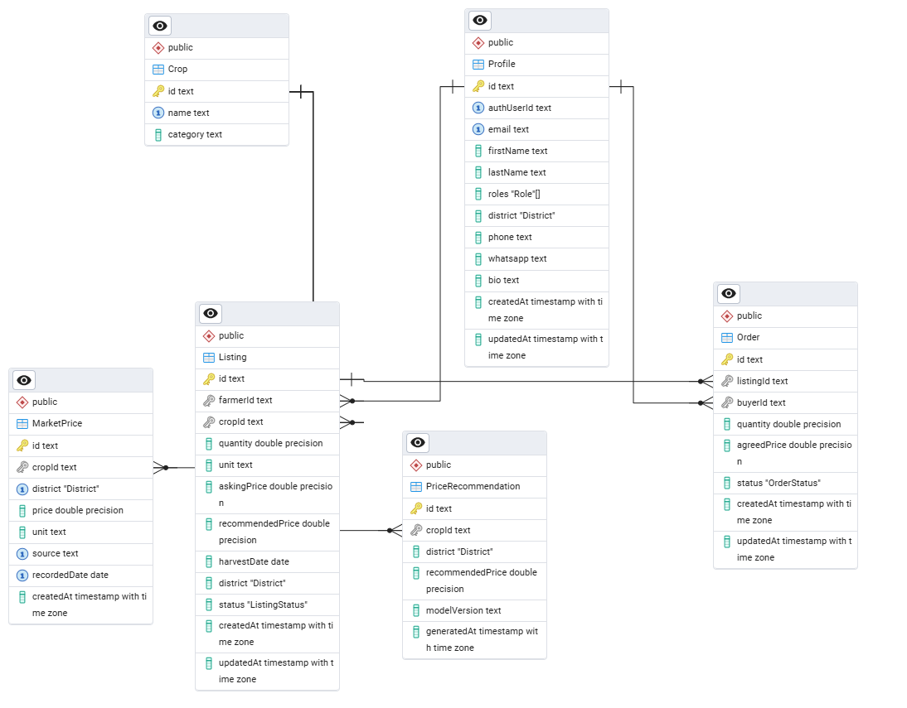

# Hargricon

An AI-powered agricultural marketplace connecting smallholder farmers with buyers across Rwanda. Farmers can list their produce, receive AI-suggested pricing, and get matched with nearby buyers — reducing post-harvest losses and improving market access.

## Tech Stack

- **Framework:** Next.js 16 (App Router)
- **Language:** TypeScript
- **Styling:** Tailwind CSS v4 + shadcn/ui
- **Database:** PostgreSQL via [Neon](https://neon.tech) (Prisma ORM)
- **Auth:** Neon Auth
- **AI:** Gemini AI (price recommendations)
- **Deployment:** Vercel

## Database Schema



## Getting Started

Install dependencies:

```bash
pnpm install
```

Copy the environment variables:

```bash
cp .env.example .env.local
```

Push the database schema:

```bash
pnpm db:push
```

Seed demo data:

```bash
pnpm db:seed
```

Run the development server:

```bash
pnpm dev
```

Open [http://localhost:3000](http://localhost:3000) in your browser.

## Adding UI Components

To add shadcn/ui components, run:

```bash
npx shadcn@latest add button
```

Components are placed in the `components/ui/` directory and imported as:

```tsx
import { Button } from "@/components/ui/button";
```

## Database Management

```bash
pnpm db:push      # Push schema changes to the database
pnpm db:studio    # Open Prisma Studio (visual DB browser)
pnpm db:seed      # Seed demo data
pnpm db:generate  # Regenerate Prisma client after schema changes
```
